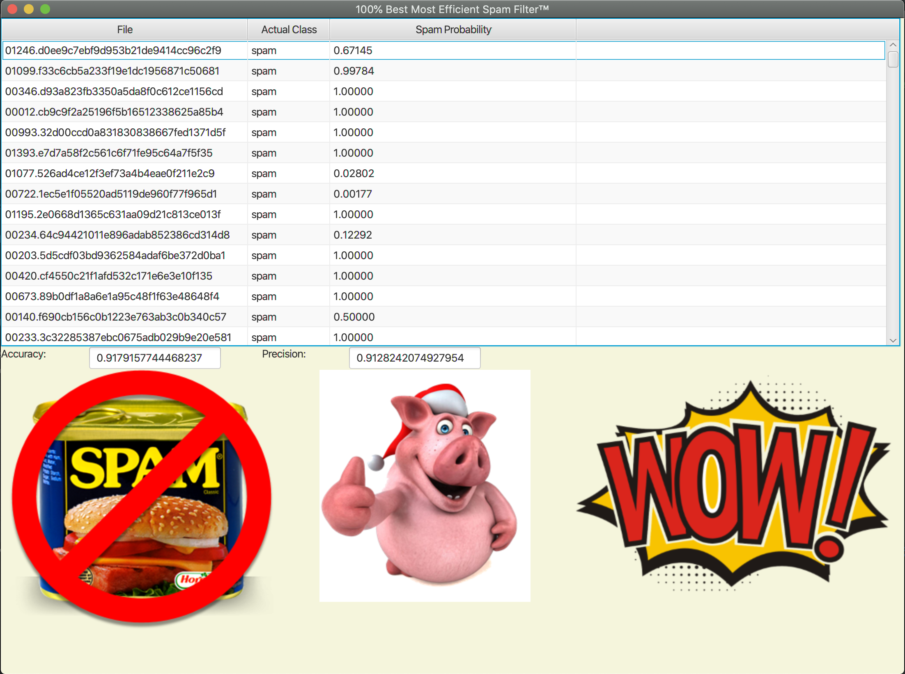

Project Information: This assignment incorporates file reading and a large data file comprised of many individual emails.  Our task was to read through certain sections marked train and determine a map of words that retain to spam and ham (which are non spam words).  Each of these unique words were than counted for the entire section of files to account for their occurence per file.  This value was then used in our calculation to determine whether or not a file was considered spam if it contained enough of our pre-determined spam words.  Our mathematical operations were normalized using logarithmic functions and our data was outputted into a table organized by file name.  The table lists each files name, their class (ham or spam) and their probability of being considered a spam email.

Improvements: Improvements that were made to increase our accuracy and precision of our probability model were adding a blacklist of common words found in emails such as contractions like "and, or, the" and these improvements increased our accuracy and precision.  We also made improvements to our UI using images such as "WOW" and "NoSpam" found on royalty free images linked in references.

How to run:  To run our application Clone the repository found at https://github.com/David-B-Robertson/Ethan-and-David-Systems-Assignment-1.  Open the project in Intelliji and run the program.  A dialog box will appear and you will be have to select the "data" folder.  Navigate to and select the SystemAssig1/src/sample/data and click "open".  The program will automatically run and a window will appear containing the table.

References: https://www.tutorialspoint.com/javafx/javafx_images.htm - tutorial on images in javafx
Image Website: https://www.hiclipart.com/
